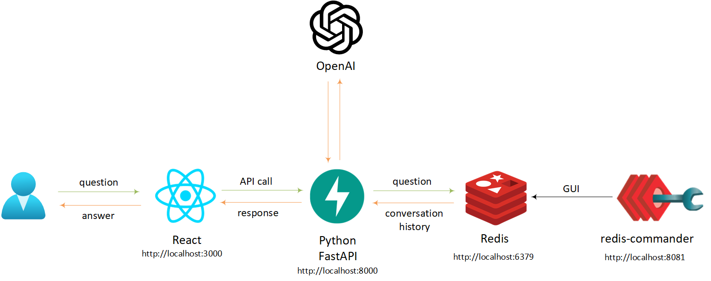
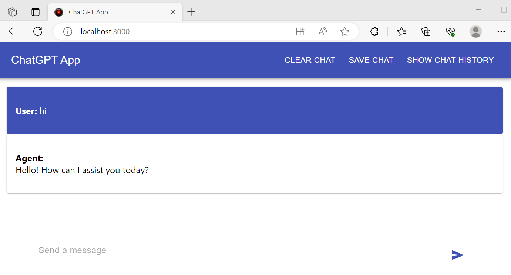
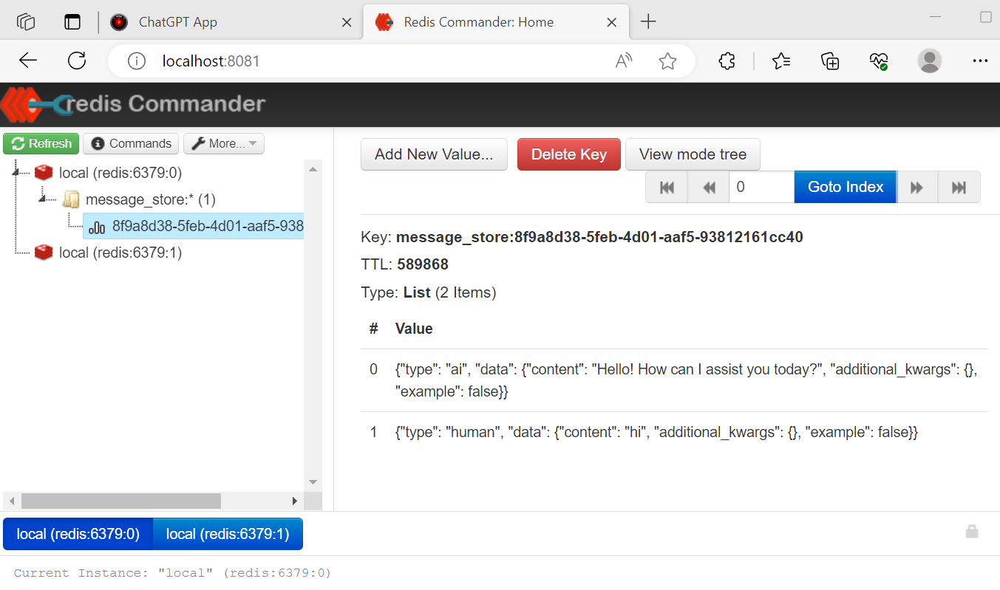
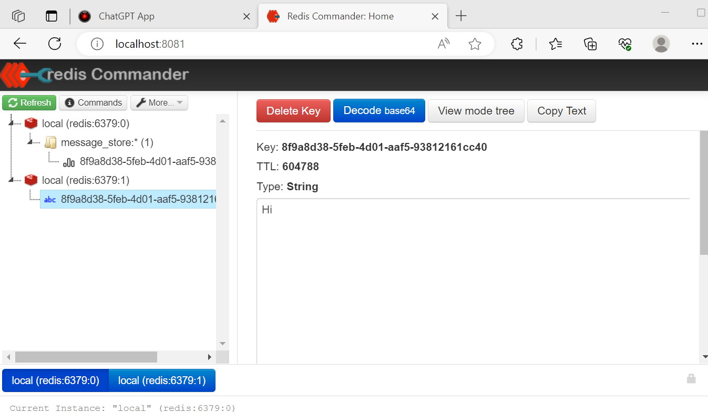

# chatgpt-create-react-app

1. [Overview](#overview)
2. [Quick Start](#quick-start)
   * [docker compose](#docker-compose)
3. [Redis](#redis)

## Overview

This was an exercise in creating a multi-tiered ChatGPT like application.  I wanted to create something from scratch to understand how you might structure this kind of application using a frontend, API and backend database for storing conversation history.  
The result is a [React](https://react.dev/) JavaScript [create-react-app](https://create-react-app.dev/) application as the frontend, talking to a Python [FastAPI](https://github.com/tiangolo/fastapi) API backend, with the conversation history being stored in Redis.  The processing of the conversation history is handled using [LangChain](https://github.com/hwchase17/langchain).



The React frontend does not talk to the OpenAI models directly.  It sends a query to the FastAPI API and it is the API which forwards on the question and returns the result to the frontend app.  

As this is using Client Side Rendering (CSR) the various services are all expected to be running on `localhost`, so is just an example of running an application locally as a starting point.  The concepts could be scaled out and the frontend could be moved to something like [Next.js](https://nextjs.org/) that supports things such as Server Side Rendering (SSR) and API routing, rather than this simple create-react-app example.

The web app interface is fairly minimalistic, with only a few basic components:



There are 4 containers that make up the example app in this repo:

| container       |  image                                                        | description                      |
|-----------------|---------------------------------------------------------------|----------------------------------|
| frontend        | ghcr.io/tonyskidmore/chatgpt-create-react-app/frontend:latest | React web app                    |
| backend         | ghcr.io/tonyskidmore/chatgpt-create-react-app/backend:latest  | Python FastAPI API               |
| redis           | redis:7 - https://hub.docker.com/_/redis                      | Conversation store               |
| redis-commander | redis-commander - https://hub.docker.com/u/rediscommander     | Redis GUI                        |

## Quick Start

The quickest method of running the application is using [Docker Compose](https://docs.docker.com/compose/).  The app was written and tested on a Windows 11 system using Windows Subsystem for Linux with Docker Desktop, and the instructions below use the [Compose V2](https://docs.docker.com/compose/migrate/) format.  


### docker compose

The first thing that must be done is to export your OpenAI API Key:

````bash

export OPENAI_API_KEY="<your-key-goes-here>"

````

Run all containers in detached mode:

````bash

docker compose up --pull always --detach

````

Stop all containers and remove data volumes (Redis conversation store)

````bash

docker compose down --volumes

````

_Note:_ do not append `--volumes` if you wish to retain the conversation history for next time you bring up the stack.

Remove stopped containers

````bash

docker compose rm --force

````

Once `docker compose up` has been executed open `http://localhost:3000` in a browser to access the app, the various components are available on the URLs below:

| component       | URL                     |
| ----------------|-------------------------|
| web interface   | http://localhost:3000   |
| backend API     | http://localhost:8000   |
| redis           | redis://localhost:6379  |
| redis-commander | http://localhost:8081   |


## Redis

Redis is used as the conversation store.  LangChain's [RedisChatMessageHistory](https://js.langchain.com/docs/api/stores_message_redis/classes/RedisChatMessageHistory) is used for this purpose.  The conversation history memory is passed by LangChain to the call to OpenAI Chat LLM.  

If we look in `redis-commander` at http://localhost:8081 we can see how that chat history is stored:



_Note:_ The UUID in the message store is created by the React app when a new message is created and passed to the API.  

When **SAVE CHAT** is selected in the web app, an entry is made into the db1 redis database with a key of the conversation UUID and the name supplied in the app as the value, this links the conversation history with the saved chat.  



Conversations are then available to be recalled using the **SHOW CHAT HISTORY** button.

_Note:_  The default TTL for entries to the Redis `db0` and `db1` databases is 7 days, after which they are automatically purged.
